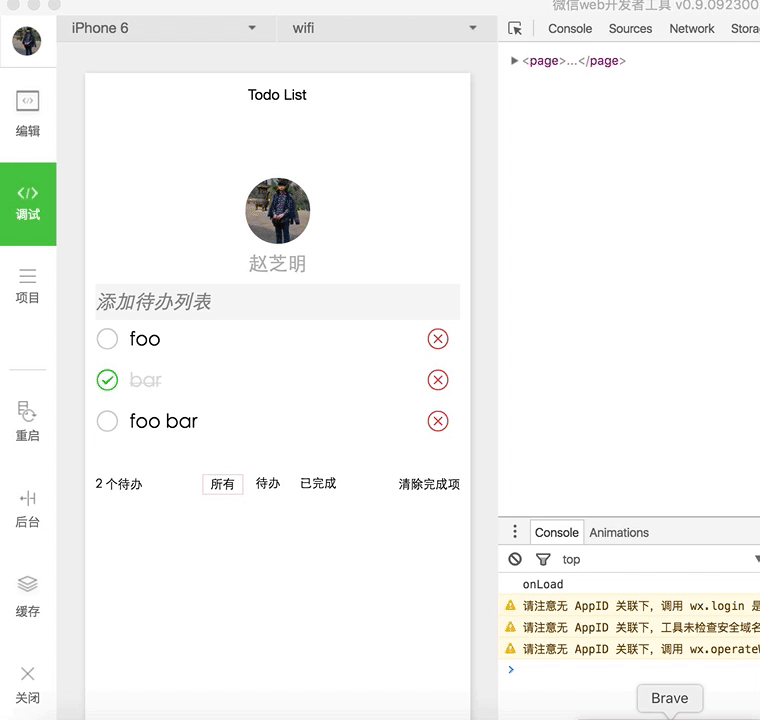

# 微信小程序之练手小玩意儿——Todo List

## 运行效果

  
## 使用方法
* 下载工程
```
git clone https://github.com/zhaozhiming/wechat-todolist.git
```
* 启动服务端
```
npm install -g json-server
cd wechat-todolist
json-server server/todo.json
```
* 微信开发者工具加载项目
* 运行小程序
